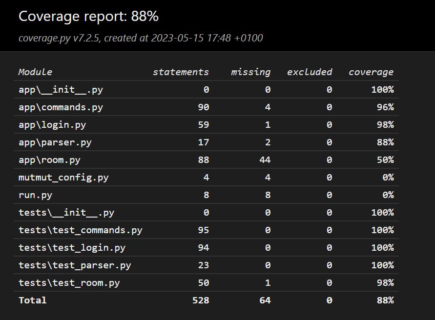

# Slay Stays 💅
'Slay Stays' is a hotel room booking application.
It is a simple [\[ISE\]](https://software-engineering.ie) student project to learn software testing as part of module CS4442.

## Authors
- [D.J. Kennedy](https://github.com/DJK101) - 22337261
- [Rosie Kennelly](https://github.com/Rosie-Kennelly) - 22340238
- [Amy Roys](https://github.com/AmyRoys) - 22355561

## Project Outline 
The aim of this project was to design, build and test a room booking system. Hence, slay-stays was born!
For this project, we adopted the practice of Test-Driven Development (TDD). In other words, made the tests before the functionality that satisfied them.
We used the pytest library over unittest as it was said to be cleaner and nicer to use online.
**Highlight features of our tests include:**
- **Highlight description**. | _Where to find it_ |
- Creating temporary 'bookings.csv' and 'users.csv' file to test on, without affecting the application files. | _test_commands.py and test_login.py_ |
- Using unitest.mock 'patch' method to simulate functionality of functions such as input, print and sys.exit. | _All test files_ |
- Using pytest's inbuilt 'mocker' functionality to check if a function was called (This was more of a learning exercise as the 'patch' method
can perform the same task). | _test_parser.py_ |
- Using regex to limit characters that could be used in usernames and testing that regex with valid and invalid usernames. 
| _commands.py and test_commands.py_ |
- Using pytest fixtures to create repetitive variables (such as csv files and current time) to have cleaner tests that were easier to write.
| _test_room.py, test_login.py and test_commands.py_ |
- Attempting to use the python mutmut to improve our tests. Though, this library didn't become as useful as we'd hoped it would be. | _mutmut_config.py_ |
- Implementing Continuous Integration with GitHub Actions. | _[Repository Actions on GitHub](https://github.com/DJK101/slay-stays/actions)_ |

## How to Run  
1. Open 'slay-stays' directory in your terminal (make sure the name of the directory is 'slay-stays' or the tests may fail)
2. To run pytest: 'python -m pytest'
3. To run application: 'python run.py' (default username: 'eoin', default password: 'ilovetracworx')

## Test Coverage

## Contributions
- **Amy -** wrote all code included in room.py and test_room.py. All work to try and make mutmut.py useful.
- **Rosie -** wrote all tests and implementations for username_is_valid() and change_username() in commands.py and test_commands.py.
- **DJ -** wrote remaining files and tests. Implemented the GitHub actions workflow.

